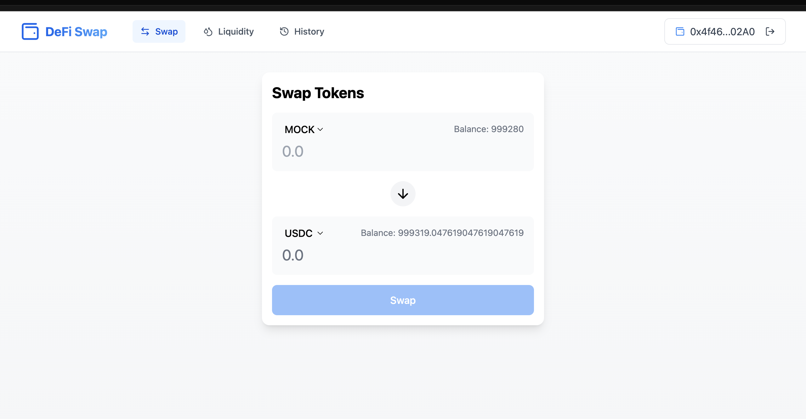
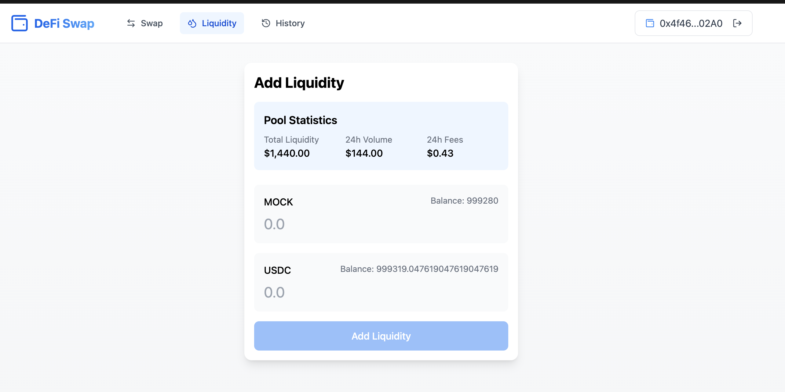
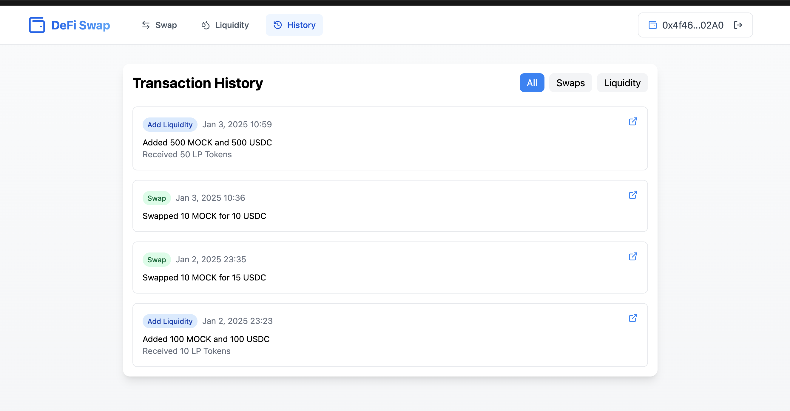

## 第一次prompt。 英文是ai工具优化后的。
```
Create a simplified Uniswap V2 frontend application with the following specifications:

Technical Requirements:
1. Wallet Integration:
   - Implement MetaMask connection
   - Implement WalletConnect protocol
   - Display wallet address and connection status
   - Add disconnect functionality

2. Token Swap Interface:
   - Create a swap page between MockERC20 and MockUSDC tokens
   - Include token selection dropdowns
   - Display token balances
   - Show estimated output amount
   - Store transaction details in localStorage with:
     * Transaction hash
     * Input/output token amounts
     * Timestamp
     * Wallet address

3. Liquidity Pool Interface:
   - Create an "Add Liquidity" page for MockERC20/MockUSDC pair
   - Display current pool statistics
   - Show user's token balances
   - Include input fields for both tokens
   - Display estimated LP tokens to be received
   - Store liquidity addition records in localStorage with:
     * Transaction hash
     * Token amounts
     * Timestamp
     * LP tokens received
     * Wallet address

4. Transaction History Page:
   - Create a unified transaction history view
   - Display both swap and liquidity addition transactions
   - Implement filtering by transaction type
   - Show transaction details:
     * Transaction type (Swap/Liquidity)
     * Token amounts
     * Transaction hash
     * Timestamp
   - Sort transactions by date (newest first)
   - Add pagination or infinite scroll for large lists

UI/UX Requirements:
- Implement responsive design
- Include loading states for transactions
- Display error messages clearly
- Add confirmation modals for transactions
- Implement token price updates in real-time

Data Storage Format:
- Use consistent localStorage structure for both transaction types
- Implement data validation before storage
- Handle storage limits appropriately
```
ai 生成了基本的页面框架，提供了mock数据。 有些问题让ai 自动解决了。 

## 更新钱包连接方式
因为bolt.new 生成的代码预览是线上实时部署的。WalletConnect 还没有注册域名，所以会报错。 让ai更改下钱包连接方式。

```
we3modal 需要的projectId 还没有注册。先不使用web3modal 实现登录。请实现自定义的按钮。

```
ai 生成了比较简单的钱包连接功能和样式。可以连接metamask。

## 实现当前链的检查和切换
```
请检查当前连接的以太坊网络是否为 Sepolia 测试网。如果检测到用户连接的不是 Sepolia 网络，请显示一个醒目的网络切换按钮，点击后可以帮助用户自动切换到 Sepolia 测试网。按钮上应显示"切换到 Sepolia 测试网"的文字提示。切换网络时需要处理可能发生的错误情况，并向用户展示适当的错误提示信息。
```
ai 给代码时useSwitchNetork， wagmi里没有导出这样的方法。 只能自己修改代码。检查当前链，ai给出的 useChainId方法，也不能正确获得当前链id。自己修改代码，使用useAccount返回的解决；

## 添加abi和合约地址。更新balance获取逻辑
手动在代码里添加了MockERC20,MockUSDC, UniswapV2Clone合约的abi和合约地址。让ai自动生成合约交互代码。 这里不能一次给太多。先更新balance获取逻辑。
```
Create a function to retrieve token balances from specified ERC20 contracts (MockERC20, MockUSDC, UniswapV2Clone) on the Sepolia network using the following requirements:

Use the contract addresses stored in contract.ts
Connect to the user's current wallet using ethers.js
Return the token balances for each specified token contract
Format the output to display:
Token symbol
Token balance with proper decimals
Contract address
The function should:

Handle connection errors gracefully
Support both individual and batch balance checks
Update balances in real-time
Use TypeScript types for better code safety
Include proper error handling for failed queries
Support async/await pattern
Please provide the implementation code following these specifications.
```
这里ai理解有误，生成了一个单独的TokenBalance 组件，但没有使用。 继续指定修改范围。

## 修改swap页面的balance
```
替换mock 数据balance。 使用合约查询的balance显示到页面上。
```
ai 实现了合约查询balance显示到页面上。

## 实现handleAddLiquidity逻辑

```
Write a function called handleAddLiquidity that implements the following liquidity addition process for a Uniswap V2 clone:

Accept parameters for:

tokenA amount
tokenB amount
tokenA contract instance
tokenB contract instance
uniswapV2Clone contract instance
user's wallet address
Perform these operations in sequence:

First approve tokenA spending by calling approve() on tokenA contract
Then approve tokenB spending by calling approve() on tokenB contract
Call addLiquidity() on the uniswapV2Clone contract with the specified amounts
After successful transaction, store the transaction details in localStorage with:
Transaction hash
Transaction type: "Add Liquidity"
Token A amount and symbol
Token B amount and symbol
Timestamp
User address
The function should handle errors appropriately and return the transaction result. The stored transaction history should be formatted to be compatible with the transaction history page display.
```
ai 基本实现了功能代码。缺少链检查和弹窗提示结果。

## 链检查和弹窗提示结果

```
发起交易前，检查连接的网络是不是sepolia。 如果不是，先切换网络。
交易成功，弹窗提示成功消息。 交易失败，弹窗提示失败消息。
```
出现一些错误，比如错误使用wagmi导出的方法，错误使用hooks。让ai修改错误。有些手动修改才行。 
经过测试，addLiquidity 功能基本实现。

## 实现swap逻辑
```
Implement the handleSwap function following these steps:

Check and validate the current network:
Verify if the connected network is Sepolia
If not, switch to Sepolia network using switchChain
Handle any network switching errors
Input validation:
Verify that fromToken, toToken, and amount are provided
check if amount <= user's token balance
Ensure amount is a valid positive number
Token approval process:
If fromToken is MockERC20:
Call approve() on the MockERC20 contract
Set approval amount equal to the swap amount
Wait for approval transaction confirmation
Execute swap:
Call UniswapV2Clone.swap() with validated parameters
Handle any potential errors during the swap
Wait for swap transaction confirmation
Post-swap actions:
Refresh token balances for both fromToken and toToken
Display success notification with transaction details
Store transaction record in localStorage with:
Transaction hash
From/to token addresses
Amount
Timestamp
Network info
Return appropriate success/error messages for UI feedback.
```

指定了修改文件，让ai修改代码。经过handleAddLiquidity的实现，一些错误ai可以自动避免了。

## swap页面的token选择
让from token 和 to token 不重复。ai完全理解并实现了逻辑。
```
Create a swap interface with the following token selection rules:

Implement mutual exclusion for the "From Token" and "To Token" selection fields:
When "From Token" is selected, automatically update "To Token" to prevent duplicate selection
When "To Token" is selected, automatically update "From Token" to prevent duplicate selection
Default token pairing behavior:
If MockERC20 is selected as "From Token", automatically set "To Token" to MockUSDC
If MockUSDC is selected as "From Token", automatically set "To Token" to MockERC20
Requirements:
Ensure users cannot select the same token in both fields
Maintain this mutual exclusion rule during all user interactions
Update the interface immediately when either token selection changes
Preserve all other existing swap functionality
```

## 最后优化下UI
```
Create a polished and user-friendly UI design with the following specifications:

Header Styling:
Implement a clean, modern header layout
Add a visually appealing logo that reflects the brand identity
Ensure consistent spacing and alignment
Use appropriate typography and color scheme
Content Layout:
Center all main content horizontally on the page
Maintain proper margins and padding
Implement responsive design principles
Ensure consistent content width across different screen sizes
Wallet Connection UI:
Design an intuitive "Connect Wallet" button with clear visual feedback
Use modern button styling with hover and active states
Include a recognizable wallet icon
Add subtle animations for interaction states
Disconnect Wallet UI:
Create a distinct "Disconnect" button that's easily accessible
Implement clear visual separation from the connect button
Add confirmation dialog for disconnect action
Ensure consistent styling with other UI elements
Technical Requirements:

Preserve all existing functionality
Maintain current wallet integration methods
Ensure cross-browser compatibility
Keep performance optimization in mind
```

## 一些截图


